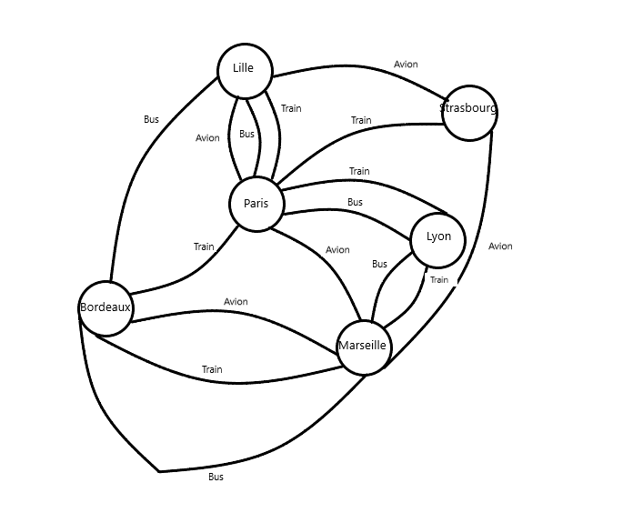

SAE S2.02 -- Rapport pour la ressource Graphes
===

*BEDU Louis, SCAVONE Enzo, TURPIN Samuel , S2-E*

Version 1 : un seul moyen de transport
---

*Cette section traite uniquement de la Version 1 du projet.*

### Présentation d'un exemple

Mme Dupont souhaite se rendre de Lille à Marseille, avec la possibilité de faire escale dans d'autres villes. Ses préférences sont les suivantes :

- Elle privilégie les moyens de transport les plus rapides, avec un temps de trajet minimal.
- Elle est prête à payer un prix raisonnable, mais souhaite limiter les émissions de CO2.
- Elle demande 3 itinéraires possibles pour comparer.

Données du problème :

- Villes : Lille, Paris, Lyon, Marseille, Strasbourg, Bordeaux
- Moyens de transport :
  - Train : Lille ↔ Paris, Paris ↔ Lyon, Lyon ↔ Marseille, Paris ↔ Strasbourg, Paris ↔ Bordeaux, Bordeaux ↔ Marseille
  - Avion : Lille ↔ Paris, Paris ↔ Marseille, Lille ↔ Strasbourg, Strasbourg ↔ Marseille, Bordeaux ↔ Marseille
  - Bus : Lille ↔ Paris, Paris ↔ Lyon, Lyon ↔ Marseille, Lille ↔ Bordeaux, Bordeaux ↔ Marseille
- Coûts de chaque trajet :

| Trajet        | Prix (€) | Émissions CO2 (kg) | Temps (h) |
|---------------|----------|-------------------|-----------|
| Lille → Paris (Train) | 50 | 10 | 1 |
| Paris → Marseille (Avion) | 100 | 20 | 0.5 |
| Lyon → Marseille (Bus) | 30 | 5 | 2 |
| Paris → Strasbourg (Train) | 40 | 8 | 2 |
| Paris → Bordeaux (Train) | 60 | 12 | 3 |
| Bordeaux → Marseille (Avion) | 90 | 18 | 1 |
| Lille → Strasbourg (Avion) | 80 | 16 | 1 |
| Strasbourg → Marseille (Avion) | 110 | 22 | 1.5 |
| Lille → Bordeaux (Bus) | 40 | 8 | 4 |
| Bordeaux → Marseille (Bus) | 50 | 10 | 5 |

Solution du problème
---

D'après les préférences de Mme Dupont, les 3 meilleurs itinéraires sont :

1. **Itinéraire 1 : Lille → Paris (Train) → Marseille (Avion)**
   - Temps total : 1.5 h
   - Coût total : 150 €
   - Émissions totales : 30 kg CO2

2. **Itinéraire 2 : Lille → Paris (Train) → Strasbourg (Avion) → Marseille (Avion)**
   - Temps total : 2.5 h
   - Coût total : 230 €
   - Émissions totales : 48 kg CO2

3. **Itinéraire 3 : Lille → Bordeaux (Bus) → Marseille (Avion)**
   - Temps total : 5 h
   - Coût total : 130 €
   - Émissions totales : 26 kg CO2

Dans ce cas, l'itinéraire 1 semble être le plus optimal en termes de temps de trajet. Cependant, les itinéraires 2 et 3 offrent d'autres alternatives intéressantes en fonction des priorités de Mme Dupont (coût, émissions de CO2).

### Modèle pour l'exemple

*Donner le graphe modélisant l'exemple ci-dessus.*
*Donner la solution du problème (càd les meilleurs itinéraires) en tant que chemins dans le graphe.*

### Modélisation pour la Version 1 dans le cas général

*Expliquer de manière abstraite comment, étant donné un problème de recherche d'itinéraire (plateforme avec tous types de lignes, moyen de transport choisi, critère d'optimisation, nombre d'itinéraires demandés) on peut construire un graphe permettant de résoudre le problème de recherche d'itinéraire. C'est à dire:*
- *quels sont les sommets du graphe par rapport aux données du problème*, 
- *quelles sont ses arêtes, par rapport aux données du problème*, 
- *comment sont définis les poids des arêtes*,
- *quel algorithme sur les graphes permet de résoudre le problème d'itinéraire (nom de l'algorithme, arguments).*

*Utiliser un vocabulaire précis sur les graphes.*

### Implémentation de la Version 1

**TestVoyageur.java**, **25/05/2024 (27d48f00b9dd471ea732c01b2bdbc4171a56ed2e)** , **[lien vers la page de cette classe](https://gitlab.univ-lille.fr/sae2.01-2.02/2024/E6/-/blob/27d48f00b9dd471ea732c01b2bdbc4171a56ed2e/poo/test/TestVoyageur.java)**
